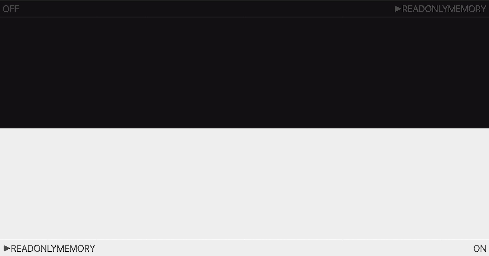

<!-- PROJECT LOGO -->
<br />
<p align="center">
  <a href="https://github.com/paulgaumer/read_only_memory">
    
  </a>

  <h3 align="center">Read Only Memory</h3>

  <p align="center">
    A web archive gathering 30 years of digital products.
    <br />
    <br />
    <a href="https://readonlymemory.net/">View Website</a>
    ·
    <a href="https://www.paulgaumer.com/#contact-form">Report Bug</a>
    ·
  </p>
</p>

<!-- TABLE OF CONTENTS -->

## Table of Contents

- [About the Project](#about-the-project)
  - [Built With](#built-with)
- [Installation](#installation)
- [Contact](#contact)

<!-- ABOUT THE PROJECT -->

## About The Project

A web archive gathering 30 years of digital products, created for a special exhibition led by Gilles Rouffineau, researcher in arts and design. Project done in collaboration with the [Jungle collective](https://www.jungleprogram.com/). Design by [Chloé Barria](http://12h.studio/).

### Built With

- [Gatsby.js](https://www.gatsbyjs.com/) - front-end
- [Airtable](https://airtable.com/) - back-end
- [Tailwind CSS](https://tailwindcss.com)
- [Styled Components](https://styled-components.com/)
- [Netlify](https://netlify.com) - hosting

<!-- GETTING STARTED -->

## Installation

1. Clone the repo

```sh
git clone git@github.com:paulgaumer/read_only_memory.git
```

2. Install NPM packages

```sh
yarn install
```

3. Start your local Gatsby server

```sh
gatsby develop
```

### Environment variables

The following variables are needed:

- `GATSBY_AIRTABLE_API_KEY` from the [Airtable API](https://airtable.com/)

<!-- CONTACT -->

## Contact

[Paul Gaumer](https://paulgaumer.com) - [@PaulGaumer](https://twitter.com/@PaulGaumer) - hello@paulgaumer.com

Project Link: [https://github.com/paulgaumer/read_only_memory](https://github.com/paulgaumer/read_only_memory)
